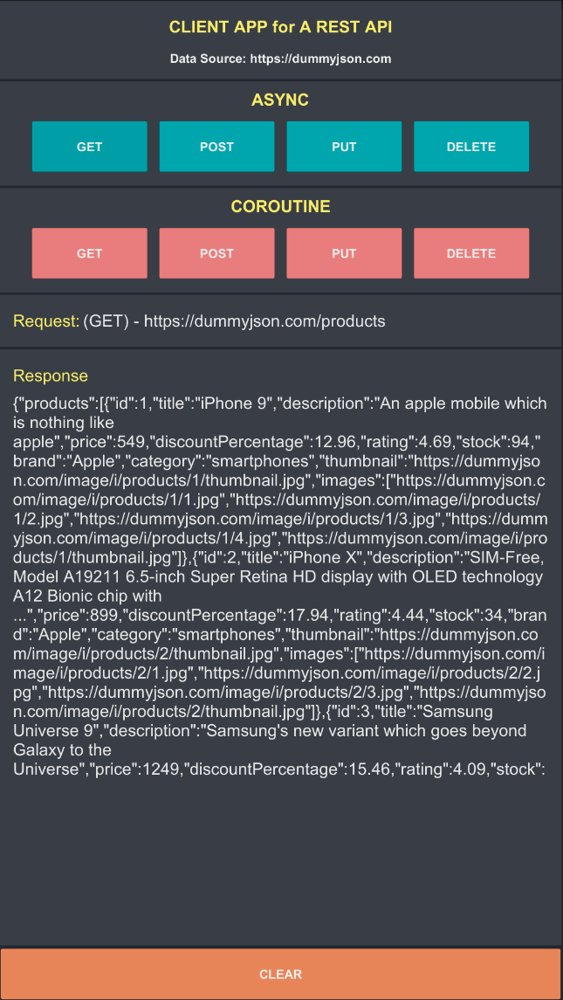
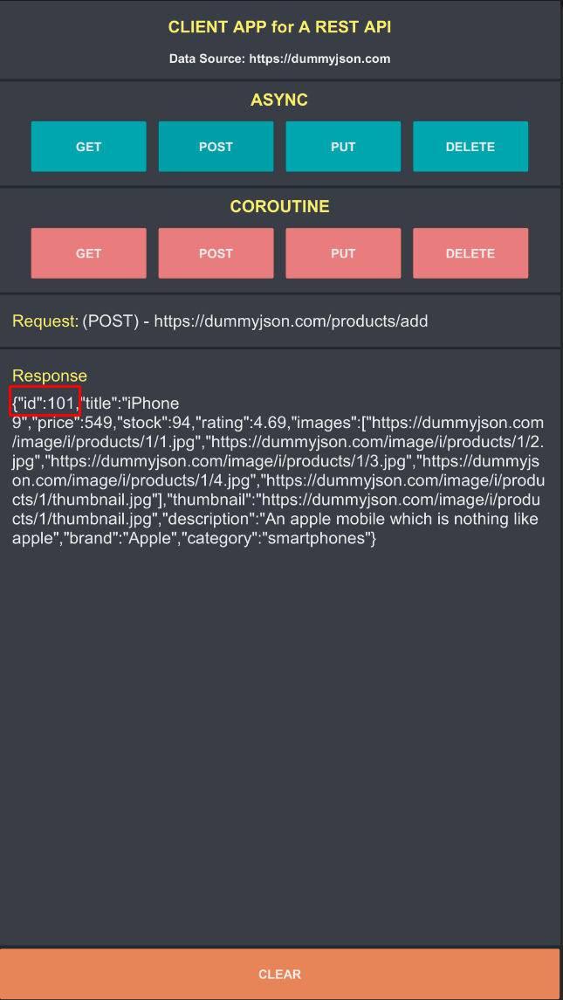
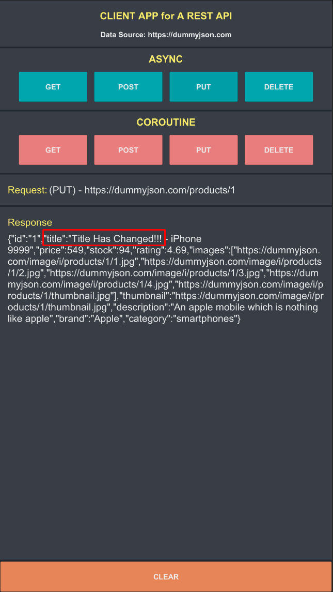
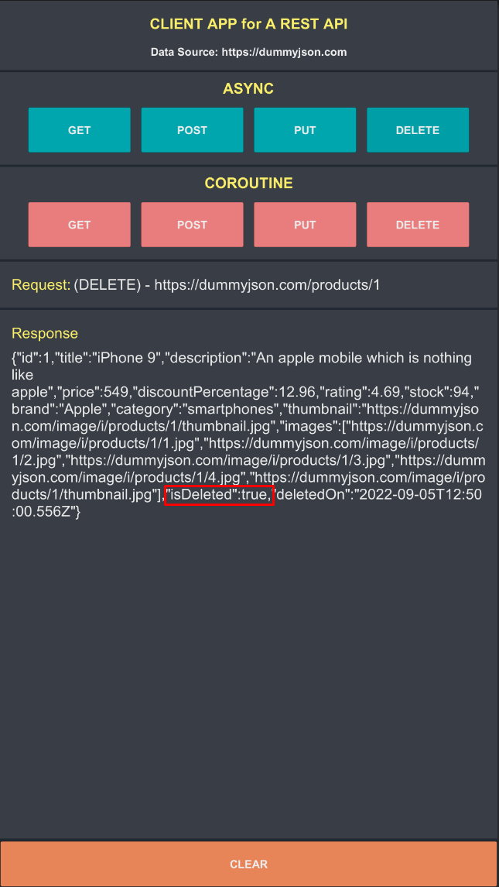

# Unity-RestApi

This is a demo application for how to use a Rest-Api in Unity.


**Dependencies**
- [UniTask](https://github.com/Cysharp/UniTask)

---

**Methods**
- [Get](https://github.com/maydinunlu/Unity-RestApi#method-get)
- [Post](https://github.com/maydinunlu/Unity-RestApi#method-post)
- [Put](https://github.com/maydinunlu/Unity-RestApi#method-put)
- [Delete](https://github.com/maydinunlu/Unity-RestApi#method-delete)
---

### METHOD: GET

```c#
public IEnumerator Get(string url, Action<string> onSuccess, Action<UnityWebRequest.Result> onFail)
{
    var request = new UnityWebRequest(url, "GET");
    request.downloadHandler = new DownloadHandlerBuffer();

    yield return request.SendWebRequest();

    OnCompleteRequest(request, onSuccess, onFail);
}
```
```c#
public async UniTask GetAsync(string url, Action<string> onSuccess, Action<UnityWebRequest.Result> onFail)
{
    var request = new UnityWebRequest(url, "GET");
    request.downloadHandler = new DownloadHandlerBuffer();

    await request.SendWebRequest();;

    OnCompleteRequest(request, onSuccess, onFail);
}
```



---

### METHOD: POST

```c#
public IEnumerator Post(string url, string data, Action<string> onSuccess, Action<UnityWebRequest.Result> onFail)
{
    var request = new UnityWebRequest(url, "POST");
    request.uploadHandler = new UploadHandlerRaw(new UTF8Encoding().GetBytes(data));
    request.downloadHandler = new DownloadHandlerBuffer();

    request.SetRequestHeader("Content-Type", "application/json");

    yield return request.SendWebRequest();

    OnCompleteRequest(request, onSuccess, onFail);
}
```
```c#
public async UniTask PostAsync(string url, string data, Action<string> onSuccess, Action<UnityWebRequest.Result> onFail)
{
    var request = new UnityWebRequest(url, "POST");
    request.uploadHandler = new UploadHandlerRaw(new UTF8Encoding().GetBytes(data));
    request.downloadHandler = new DownloadHandlerBuffer();

    request.SetRequestHeader("Content-Type", "application/json");

    await request.SendWebRequest();

    OnCompleteRequest(request, onSuccess, onFail);
}
```



---

### METHOD: PUT

```c#
public IEnumerator Put(string url, string data, Action<string> onSuccess, Action<UnityWebRequest.Result> onFail)
{
    var request = new UnityWebRequest(url, "PUT");
    request.uploadHandler = new UploadHandlerRaw(new UTF8Encoding().GetBytes(data));
    request.downloadHandler = new DownloadHandlerBuffer();

    request.SetRequestHeader("Content-Type", "application/json");

    yield return request.SendWebRequest();

    OnCompleteRequest(request, onSuccess, onFail);
}
```
```c#
public async UniTask PutAsync(string url, string data, Action<string> onSuccess, Action<UnityWebRequest.Result> onFail)
{
    var request = new UnityWebRequest(url, "PUT");
    request.uploadHandler = new UploadHandlerRaw(new UTF8Encoding().GetBytes(data));
    request.downloadHandler = new DownloadHandlerBuffer();

    request.SetRequestHeader("Content-Type", "application/json");

    await request.SendWebRequest();

    OnCompleteRequest(request, onSuccess, onFail);
}
```



---

### METHOD: DELETE

```c#
public IEnumerator Delete(string url, Action<string> onSuccess, Action<UnityWebRequest.Result> onFail)
{
    var request = new UnityWebRequest(url, "DELETE");
    request.downloadHandler = new DownloadHandlerBuffer();

    request.SetRequestHeader("Content-Type", "application/json");

    yield return request.SendWebRequest();

    OnCompleteRequest(request, onSuccess, onFail);
}
```
```c#
public async UniTask DeleteAsync(string url, Action<string> onSuccess, Action<UnityWebRequest.Result> onFail)
{
    var request = new UnityWebRequest(url, "DELETE");
    request.downloadHandler = new DownloadHandlerBuffer();

    request.SetRequestHeader("Content-Type", "application/json");

    await request.SendWebRequest();

    OnCompleteRequest(request, onSuccess, onFail);
}
```


